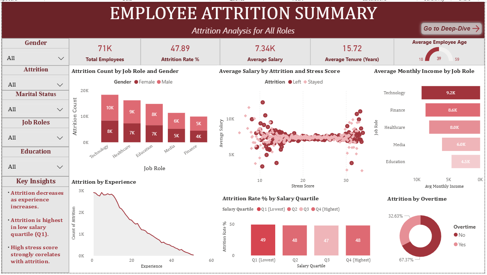
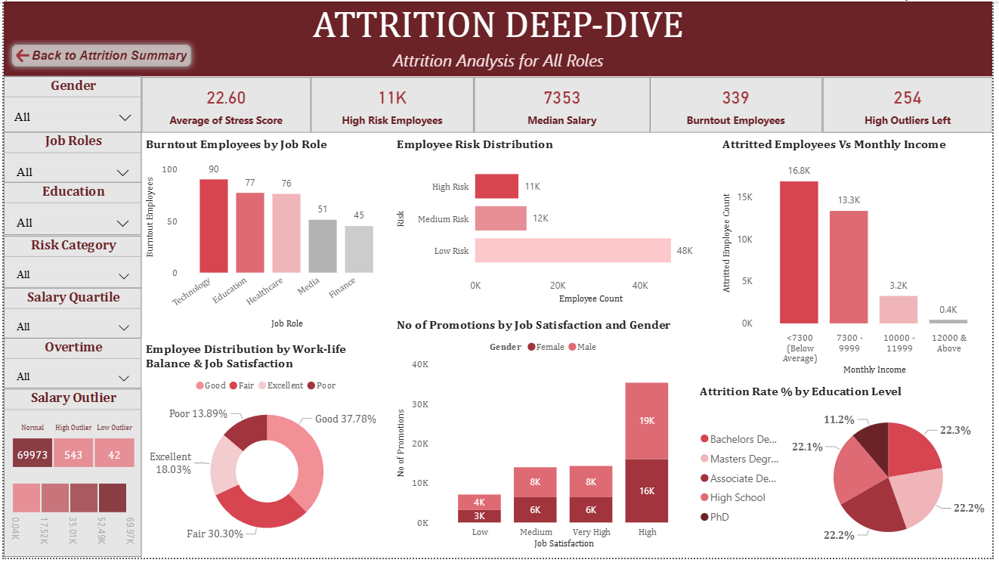

# Employee Attrition Analysis (SQL + Power BI)

End-to-end data analysis of an employee attrition dataset, including data cleaning, transformation, and advanced analytics. Uses window functions, aggregations, and feature engineering to uncover key drivers of attrition, segment employee risk, and generate actionable insights that are visualized using Power BI dashboard for deeper exploration.

The project includes:
- Data cleaning & preprocessing
- Exploratory data analysis (EDA)
- Advanced SQL analytics
- Power BI dashboard for visualization
  
---

## Objectives
- Identify factors influencing employee attrition
- Analyze salary, experience, and job roles
- Evaluate impact of overtime and commute distance
- Detect high-risk employees and burnout prone employees
- Build a stress scoring system
- Present insights through an interactive dashboard

---

## Dataset
- Source: Kaggle  
- Dataset: Employee Attrition Uncleaned Dataset
- Link: https://www.kaggle.com/datasets/nikhilbhosle/employee-attrition-uncleaned-dataset

---

## Data Cleaning & Preparation (SQL)
- Removed duplicate records using 'ROW_NUMBER()'
- Cleaned numeric fields using 'REGEXP_REPLACE'
- Trimmed and standardized text fields
- Renamed inconsistent column names
- Performed validation checks (age, income)

---

## Key Analyses

### Attrition Insights
- Overall attrition rate
- Attrition by job role
- Attrition by salary bands

### Employee Segmentation
- Risk categorization (High / Medium / Low)
- Salary quartiles using `NTILE()`
- Experience-based grouping

###  Advanced SQL Techniques
- Window functions (`RANK`, `DENSE_RANK`, `NTILE`)
- CTEs (Common Table Expressions)
- Conditional aggregation

###  Custom KPI Creation
- Created a **Stress Score KPI** based on:
  - Job Satisfaction
  - Work-Life Balance
  - Number of Promotions
  - Distance from Home

### Power BI Dashboard
 The cleaned and transformed dataset is visualized in a two-page interactive dashboard:
- **Employee Attrition Summary**
  - KPIs such as Attrition Rate, Salary, Tenure, etc.
  - Attrition by Job Role & Gender
  - Attrition by Experience
  - Salary vs stress correlation
  - Overtime impact
- **Attrition Deep Dive**
  - Burntout employees by Job Role
  - Risk distribution among employees
  - Salary outliers
  - Work-life Balance & Job Satisfaction impact
  - Attrition rate by Education level

## Dashboard Preview

### Employee Attrition Summary

- Highlights
  - Overview of key KPIs such as total employees, attrition rate, and average salary
  - Attrition breakdown by job role, gender, and experience
  - Salary vs stress correlation analysis
  - Impact of overtime on employee attrition

### Attrition Deep Dive

- Highlights
  - Identification of high-risk and burnout-prone employees
  - Salary outlier analysis and its impact on attrition
  - Work-life balance vs job satisfaction relationship
  - Attrition distribution across education and job roles 
---

## Key Insights
- Employees with **low salary + overtime** are high-risk
- Attrition significantly decreases with experience
- High stress score is closely related with attrition
- Certain job roles show higher burnout levels
- Promotions significantly impact job satisfaction

---

## Tools & Technologies
- SQL (MySQL) - Data cleaning, transformation, analysis
- Power BI - Dashboard & data visualizations
- DAX - Measures & Calculated columns

---
